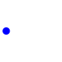
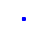
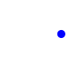
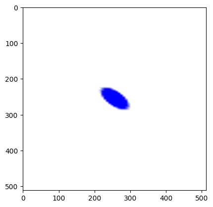

# Simulated Rolling Shutter Effect with Image Sequence Generation

This project generates a sequence of images of a moving object and combines them into a final composite image that visually simulates the **rolling shutter effect**. The rolling shutter effect is often seen in photography and video where the image sensor captures different parts of the scene at slightly different times, resulting in characteristic distortions for moving objects. In this project, we replicate this effect through sequential image capture and compositing, where each frame represents a "scan" of the scene.

## Project Details and Rolling Shutter Effect Simulation

### 1. Generating a Moving Object Sequence
The project captures a sequence of 512 images to represent a moving object, specifically a blue circle moving horizontally from left to right across a static background. Here’s how this process simulates a rolling shutter:

   - **Image-by-Image Capture**:
     - Each frame in the sequence captures a moment in the object's movement, equivalent to scanning the scene line-by-line as a rolling shutter would.
     - This is done at a set interval of 1 second, which in the final composite allows for a delayed-capture effect similar to how each line in a rolling shutter camera is exposed at a different time.
   - **Movement Step Calculation**:
     - The object moves from a defined start position (`[10, 50]`) to an end position (`[90, 50]`). Each frame’s position is calculated based on the total distance divided by the number of images (512), which simulates a smooth horizontal motion.

### 2. Composite Image Creation to Simulate Rolling Shutter Effect

In a rolling shutter, each line or row of pixels is exposed sequentially, which means the top part of the image captures the object at a slightly different position than the bottom part, causing stretching or skewing in fast-moving scenes. To mimic this, the project uses each frame in the sequence as a source for a "slice" of the final composite image:

   - **Resizing for Consistency**:
     - Each frame is resized to a uniform 512x512 dimension, which aligns the image dimensions for easier row-by-row compositing.
   - **Row Segmentation and Placement**:
     - The final composite image is represented as a matrix of 512 rows, with each row capturing a different frame's "slice" of the moving object.
     - Using the `n_lignes_blocs` parameter, each frame contributes an equally sized row segment to the composite. This process closely resembles how a rolling shutter scans each row progressively over time, resulting in a combined image that displays a stretched or distorted version of the moving object.
   
### 3. Visualizing and Interpreting the Rolling Shutter Effect

   - **Final Distortion**:
     - The final composite matrix (`Matrice_zeros`) contains rows from each frame, which creates a visual effect where the object appears "smeared" horizontally. This resembles the classic rolling shutter artifact, where fast motion during capture causes an object to appear elongated or skewed.
   - **Periodicity and Customization**:
     - By altering the `num_images`, `interval`, and `movement_step` parameters, users can modify the speed and smoothness of the simulated effect. Adjusting the number of rows contributed by each frame (`n_lignes_blocs`) further changes how "stretched" or "disjointed" the final effect appears, mimicking different shutter speeds or frame rates.

Here are four sample images from the 512-image sequence, showing the object's movement from the beginning to the end:

  
  
  

The final composite image below summarizes the complete sequence, merging all 512 images into a single frame:

### 4. Project Structure and Usage

- **Functions**:
  - `image_array()`: Loads and resizes individual frames, transforming them into a format compatible with the composite matrix.
- **Output**:
  - The final composite image, displayed using Matplotlib, visually demonstrates the impact of the rolling shutter effect. Each row’s progression along the object’s path simulates the way motion appears elongated in a rolling shutter photograph or video.
- **Customization**:
  - Parameters like `interval`, `num_images`, and `movement_step` can be adjusted to simulate faster or slower shutter speeds and capture intervals, allowing users to experiment with different rolling shutter effects.

This project is a simple yet effective way to visualize the rolling shutter effect using Python, Matplotlib, and basic image processing techniques, making it a great starting point for understanding motion capture and distortion in digital imaging systems.
